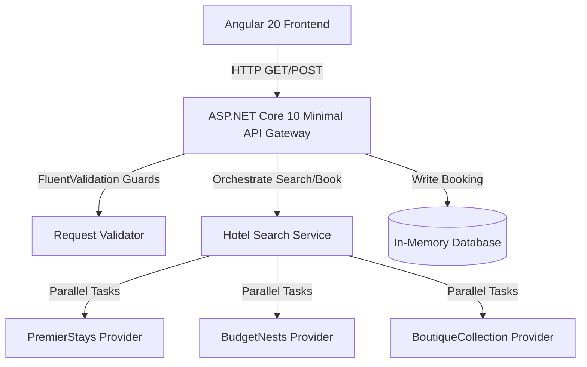

# HotelStay Booking Platform

A unified hotel search, aggregation, and booking application built for the **SkyRoute Travel Platform**. This repository includes a high-performance **ASP.NET Core 10 Minimal API** backend and a responsive **Angular 20 Standalone / Angular Material** frontend.

---

## 🏛️ Architectural Overview & Design Patterns

The platform is designed to be highly scalable, fault-tolerant, and easy to extend. It enforces a clean separation of concerns and relies on the following design patterns:

### 1. Unified Architecture Workflow


### 2. Design Patterns Applied
* **Provider Pattern (Polymorphism & OCP)**: Every external provider API maps to a concrete implementation of the `IHotelProvider` interface. Adding new providers does not touch the search aggregator or booking services.
* **Parallel Aggregation & Resiliency**: Queries are executed across all registered providers in parallel using `Task.WhenAll`. Individual provider exceptions are caught and isolated, allowing healthy providers to return results smoothly.
* **Repository & Dependency Injection**: High-cohesion classes are registered via DI containers, separating the persistence layer from presentation/minimal endpoints.
* **Dual-Layer Validation**: Re-usable validation guards verify document eligibility (Passport required for international cities, National ID accepted for domestic cities) on both the client (Angular Reactive Forms) and the server (FluentValidation).

---

## 📡 Core System Capabilities & Providers

### Integrated Providers
1. **PremierStays**
   - *Target*: Premium accommodations.
   - *Output*: PascalCase JSON, comprehensive amenities, star ratings.
   - *Policies*: Free cancellation up to 48 hours before check-in, or Non-refundable.
2. **BudgetNests**
   - *Target*: Cost-effective accommodation.
   - *Output*: snake_case JSON, minimal detail, no ratings or amenities.
   - *Resiliency*: Returns an `available: false` attribute. The aggregation service filters these out automatically.
   - *Policies*: Flexible cancellation up to 24 hours before check-in, or Non-refundable.
3. **BoutiqueCollection (Live Tweak Scenario)**
   - *Target*: Boutique hotels.
   - *Characteristics*: Deluxe and Suite room types only (Standard returns unavailable). Adds a flat £15/night fee.
   - *Policies*: Free cancellation up to 72 hours before check-in.

### Destination Document Requirements
| Destination Type | Seeded Cities | Requirement Rule | HTTP Code on Fail |
| :--- | :--- | :--- | :--- |
| **Domestic** | Hyderabad, Bangalore | Passport **or** National ID accepted | 200 OK |
| **International** | London, Paris, Dubai | Passport **strictly required** | 422 Unprocessable Entity |

---

## 💻 Tech Stack & Folder Layout

### Backend (`HotelStay.Api`)
* **Core**: .NET 10.0 Minimal APIs, C# 13
* **Validation**: FluentValidation
* **Persistence**: Entity Framework Core & In-Memory Database
* **Documentation**: Swagger UI / OpenAPI

### Frontend (`hotelstay-ui`)
* **Core**: Angular 20 (Standalone Components)
* **Styling**: Angular Material, CSS Grid/Flexbox
* **State & Flow**: RxJS, Angular Signals, Reactive Forms
* **Testing**: Vitest & JSDOM

### Directory Structure
```
hotelstay-booking-platform/
├── HotelStay.Api/             # C# Backend API
│   ├── DomainEntities/        # Core Database Entity schemas
│   ├── Enums/                 # RoomType, DocumentType
│   ├── Persistence/           # EF DbContext & SeedData helpers
│   ├── ApplicationInterfaces/ # IHotelProvider & Service Contracts
│   ├── InfrastructureProviders/ # PremierStays, BudgetNests, BoutiqueCollection implementations
│   ├── Services/              # Search Aggregation & Validation Services
│   ├── Validators/            # FluentValidation custom rules
│   └── Endpoints/             # Grouped Minimal API route mapping
├── HotelStay.Tests/           # xUnit Unit & Integration Tests
└── hotelstay-ui/              # Angular 20 Material Frontend
    ├── src/
    │   ├── app/
    │   │   ├── core/          # Interceptors, Models, Services
    │   │   ├── features/      # Search, Results, Booking, Confirmation pages
    │   │   └── shared/        # UI Cards, Layout Shell
    └── package.json           # Vitest config and dependencies
```

---

## 🚀 Running the Platform Locally

You can launch both the C# backend and Angular frontend concurrently (including running `npm install` for the frontend if `node_modules` is not present) using one of the following simple options:

### Option A: PowerShell Script (Recommended for Windows)
This script checks for frontend dependencies, installs them if missing, and launches **both projects in separate PowerShell windows** so you can easily view and manage logs independently:
```powershell
.\run.ps1
```

### Option B: Unified NPM Script (Cross-Platform)
This command installs the root runner dependencies, installs frontend dependencies, and runs both applications concurrently in a single terminal session:
```bash
npm run dev
```

### Option C: Bash Script (Linux / macOS / Git Bash)
```bash
./run.sh
```

---

### Alternative: Running Individually

#### 1. Running the C# Backend
Restore and start the backend Minimal API server (runs on `http://localhost:5000` by default):
```bash
# Build the solution
dotnet build

# Run the API project
dotnet run --project HotelStay.Api
```
* Once started, visit the Swagger documentation to inspect endpoints: 👉 **`http://localhost:5000/swagger`**

#### 2. Running the Angular Frontend
Install dependencies and launch the Angular development server:
```bash
# Navigate to the frontend directory
cd hotelstay-ui

# Install npm dependencies
npm install

# Start the dev server (runs on http://localhost:4200)
npm start
```
* Open your browser and navigate to 👉 **`http://localhost:4200/`** to search and book.

---

## 🧪 Running Tests

### Backend Unit Tests (xUnit)
Run the 19 unit tests testing aggregation resiliency, data mappings, document validator guards, and DB transactions:
```bash
dotnet test
```

### Frontend Unit Tests (Vitest)
Run the 20 unit tests validating form state validation, custom badge displays, reactive router parameter bindings, and component layouts:
```bash
cd hotelstay-ui
npm run test -- --watch=false
```

---

## 🤖 GitHub Copilot / AI Usage Disclosure

During development, GitHub Copilot was utilized to accelerate the coding workflow. Below is a summary of how AI influenced the final solution:

### Accelerated Features (Copilot Generated)
* **Boilerplate Setup**: Scaffolding entity classes, DTO request/response records, and dependency injection wire-up.
* **Mock Listings**: Populating the representative lists of hotel listings, pricing databases, and amenities details inside provider stubs.
* **Component Frameworks**: Creating templates for Angular components and mapping material cards.
* **Test Template Scaffolding**: Fast generation of standard test files for Angular components and simple C# validation edge cases.

### Developer Guidance & Critical Interventions (Manually Tuned)
* **Orchestrating Resiliency**: Copilot initially generated blocking tasks for provider calls. Human intervention was needed to construct clean asynchronous tasks using `Task.WhenAll` wrapped in individual `try-catch` blocks to protect search aggregation from single-provider failures.
* **CORS Settings & Headers**: Hand-crafted CORS policies in backend startup settings to bypass browser restrictions for local client servers.
* **Date Parsing & Formatting**: Solved JavaScript native timezone shifts during date serialization by normalizing dates to explicit `YYYY-MM-DD` strings before REST calls.
